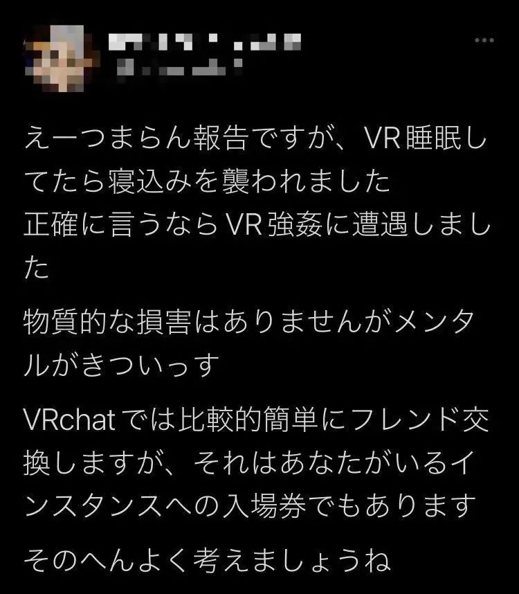

<!--
 * @Date: 2023-04-13 16:31:36
 * @LastEditors: Cai_shuyang
 * @LastEditTime: 2023-05-13 15:32:27
 * @FilePath: \Logs\Marx\README.md
-->

# 马原学习笔记及日志

## 导论

***本章的主要内容：***

* [ ] [马克思主义的含义](#马克思主义的含义)
* [ ] [马克思主义的创立](#马克思主义的创立)
* [ ] [马克思主义的发展](#马克思主义的发展)
* [ ] [马克思主义的基本特征](#马克思主义的基本特征)
* [ ] [马克思主义的当代价值](#马克思主义的当代价值)
* [ ] [学习马克思主义的态度与方法](#学习马克思主义的态度与方法)

### 马克思主义的含义

马克思主义（Marxism）是马克思主义理论体系的简称，是关于全世界无产阶级和全人类彻底解放的学说。它由***马克思主义哲学***、***马克思主义政治经济学***和***科学社会主义***三大部分组成，是马克思、恩格斯在批判地继承和吸收人类关于自然科学、思维科学、社会科学优秀成果的基础上于19世纪40年代创立的，并在实践中不断地丰富、发展和完善的无产阶级思想的科学体系。

### 马克思主义的创立

> *关于马克思主义的诞生或创立，毛泽东和列宁都有明确的论断和论述。毛泽东在党的七大的结论中说：“1843年马克思创造了马克思主义”（《毛泽东在七大的报告和讲话集》，北京：中央文献出版社，1995年，第203页。）；列宁说，马克思首次提出这个学说是在1844年。他们都是指1843年-1844年《德法年鉴》中马克思的*《〈黑格尔法哲学批判〉导言》和《论犹太人问题》的写作和出版日期。因为在文章中，正如列宁所说，明确地提出了“马克思学说中的主要的一点，就是阐明了无产阶级作为社会主义社会创造者的世界历史作用”。在《马克思学说的历史命运》*一文中，列宁作了这样的论述：“马克思首次提出这个学说是在1844年。马克思恩格斯合著的，于1848年问世的《共产党宣言》，已对这个学说作了完整的、系统的、至今仍然是最好的阐述。”（**《列宁选集》** 第2卷，北京：人民出版社，1995年，第305页。）*

### 马克思主义的发展

1. 自由竞争资本主义阶段,无产阶级登上历史舞台，马克思主义的创立和传播阶段。
2. 垄断资本主义阶段,社会主义变成现实开辟由资本主义向社会主义过渡时代，马克思主义发展到列宁主义阶段。
3. 马克思主义中国时代化。

***下面的就有点无聊了，如无考试需求，可直接跳过（个人观点）***

---

### 马克思主义的基本特征

马克思主义的五大特征：

1. ***科学性***——马克思主义是对自然、社会和人类思维发展本质和规律的正确反映。
2. ***革命性***——马克思主义的集中表现了彻底的批判精神和鲜明的无产阶级立场
3. ***实践性***——马克思主义是从实践中来，到实践中去，在实践中接受检验，并随实践而不断发展的学说。
4. ***人民性***——人民至上是马克思主义的政治立场。马克思主义政党把人民放在心中最高位置，一切奋斗都致力于实现最广大人民的根本利益。
5. ***发展性***——马克思主义是不断发展的学说，具有与时俱进的理论品质。

### 马克思主义的当代价值

1. 观察当代世界变化的认识工具
2. 指引当代中国发展的行动指南
3. 引领人类社会进步的科学真理

### 学习马克思主义的态度与方法

1. 努力学习和掌握马克思主义的基本立场观点方法
2. 努力学习和掌握马克思主义中国化时代化的理论成果
3. 坚持理论联系实际的马克思主义学风
4. 自觉将马克思主义内化于心、外化于行。

---

## 4.27 日志

### 案例陈述

这节课讨论了一个问题，和 ***“VR性侵”*** 有关大概陈述如下：

> *前几天有一位日本网友发了一条具有时代意义的推特，控诉自己在进行“VR睡眠”时遭遇**VR强奸**：*
>
> *“我在VR睡眠的时候被袭击了，说得准确一点是遭到VR强奸了。虽然没有物质上的损害，但心理上相当难受。在VRchat互加好友相当简单，但那也同时是进入你所在世界的入场券，这件事值得深思。”*
>
> 
>
> *这位日本网友所遭遇的VR强奸，要从一个叫做《VRchat》的游戏说起。《VRChat》是VRChat Inc推出的一款在线VR角色扮演游戏。实际上，这就是一个VR版的高度自由聊天室，在这里，你可以创造自己的虚拟形象，与其他玩家进行社交。而且这款游戏可以实时追踪你的动作、手势、口型等等。有些比较热爱虚拟世界的玩家，会佩戴仪器在游戏中睡眠挂机，以此获得心理慰藉和更好的睡眠质量。秋空所遭遇的恶性事件，就是在其进行VR睡眠时发生的，她的一个好友进入了其VR睡眠的房间，并跨坐在其上摆动腰部，模拟性行为。*

### 相关舆论

该事件曝光出来之后，很快出现了相关的舆论。

> *有网友认为这种**VR强奸**带来的心理冲击某种程度上并不亚于现实的猥亵：*
>
> 
>
> 
>
> *不过有些网友则认为，将这种VR形式的骚扰与强奸类比未免小题大做：*
>
> 

### 个人看法

* 首先，这类事件在目前并不算违法，因为VR的普及时间并不长，相关的法律法规并未得到完善。
* 虽然目前并不违法，但是绝对违反公序良俗，即使缺少强制力的制约，相关的平台、社区也应该完善规章制度，打造一个相对和谐的社区环境。
* 至于未来是否要通过法律手段，对这类行为进行严惩，甚至上升到接近对应现实行为的程度，个人的看法是，视具体情况而定，但应该以教导、规范其行为为导向，而以非惩戒为主要目的，主要是基于以下几点：
  * 虽然近些年所谓的“元宇宙”一直甚嚣尘上，关于VR世界的讨论热度也一直很高，但就最基本的技术条件而言，要达到“元宇宙”宣传中的那种模拟程度，目前的硬件技术还不够成熟；就商业价值而言，普通人如果想在“元宇宙”中进行娱乐活动，性价比明显不高，而且除了极少部分玩家，也没有多少人会整天佩戴VR设备活跃在虚拟世界中，当下对于“元宇宙”的种种描述带有相当的“炒作”成分，因此，我认为，“元宇宙”并不会如预期的一样迅速普及，甚至仅仅可能是一个虚幻的泡沫。如果“元宇宙”模式仅仅存在于一个小范围圈层中，为“VR强奸”专门编写一部法律、设立一个罪名实际上意义不大，因为这种行为不具有普遍性，完全可以引用其他法律条文来进行判定。但如果“元宇宙”普及程度很高，那可能就有设立相关法律的必要了。
  * 如果对于某个领域的限制过多，势必会对该领域的发展积极性存在一定影响，同样如果对于VR领域的法律过于严苛，那么，相关产业的发展速度可能会被减缓，产业发展滞后又会影响到相关技术的研发，最坏的结果就是我国相关的各项技术与其他国家的差距被拉开，所以，如果不得不为VR立法，就一般经验而言，教导性是要优于惩戒性的。当然，如果VR全面普及，全民活跃度高，且“VR犯罪”现象普遍，且社会危害严重，那就有必要好好整治了。

素材来源：[“VR性侵”震惊全网：可怕！变态男再一次击碎我的三观](https://mp.weixin.qq.com/s?__biz=MzAxODAzNDUxOQ==&mid=2655169290&idx=1&sn=90ea546e677aad04fc744afcd8e13db4&chksm=806a7132b71df8241d9787defa449cb2cee9c76d534f5094b81324fc57b21e4f834a611749bd&scene=27)

---

## 5.8 日志

### 问题讨论

这节课我们关于网络上标签化的现象进行了讨论。
